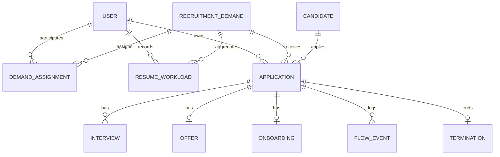
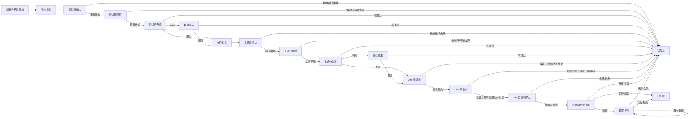

# 招聘信息管理系统 V1 产品需求文档

| 项目 | 内容 |
|---|---|
| 文档版本 | V1.1 |
| 文档状态 | V1 业务基线已确认 |
| 更新日期 | 2026-08-27 |
| 适用范围 | 招聘部门内部使用 |
| 目标版本 | 招聘信息管理系统 V1 |

## 1. 项目背景

招聘部门当前主要通过以下两份 Excel 管理招聘过程与招聘结果：

- `【社招面试进度】-26年.xlsx`
- `招聘成果及待报到人员信息汇总-2026年.xlsx`

现有工作方式已经覆盖简历推荐、面试、候选人流失、Offer、待报到、入职、重点岗位和招聘成果汇总等业务，但存在以下问题：

1. 同一候选人的信息分散在多张工作表中，需要重复更新。
2. 候选人缺少系统级唯一编号，历史数据难以稳定关联。
3. 招聘状态及 Out 原因缺少统一口径。
4. 工作量、招聘漏斗和成果数据依赖人工汇总。
5. 月度表、年度汇总表和专项台账之间可能出现更新不同步。
6. 管理者无法随时按 HR、岗位、需求、时间范围查看数据。
7. 历史过程缺少不可篡改的操作留痕。

## 2. 产品目标

V1 需要实现以下目标：

1. 以候选人招聘流程为主线，对合格候选人从建档到入职或 Out 的全过程留痕。
2. 保持录入轻量化，不要求 HR 为每一份未通过筛选的简历建立候选人档案。
3. 支持一个招聘需求同时分配给多名 HR。
4. 坚持“一名候选人由一名 HR 负责到底”的业务原则。
5. 自动生成个人工作量、招聘漏斗、转化率和管理看板。
6. 支持至少从 2026 年 1 月开始的历史 Excel 数据迁移。
7. 通过角色权限、操作日志和数据校验降低误操作风险。

## 3. V1 非目标

以下内容暂不纳入 V1：

- 不要求面试官登录系统或自行填写面试评价。
- 不在系统内完成 Offer 审批，只记录外部审批结果。
- 不处理同一候选人再次应聘、跨岗位转岗等低频复杂场景。
- 不接入企业微信、短信或邮件通知，仅提供站内待办。
- 不建设入职后的试用期、绩效和离职管理。
- 不将劳务外包纳入 V1 招聘流程，后续可作为独立人员类型建设。
- 不按字段设置差异化查看权限；用户在有权查看某条业务记录时，可以查看该记录全部业务字段。
- 不对接 BOSS、猎聘等招聘平台接口。

## 4. 核心业务原则

### 4.1 推荐阶段采用数字统计

HR 在招聘平台发现简历后，不需要立即逐人建档，只需按以下粒度填写推荐总量：

```text
推荐日期 + 招聘需求 + 推荐HR + 招聘渠道
```

仅当简历筛选合格后，HR 才创建候选人档案。

### 4.2 合格后进入候选人流程

候选人建档后默认进入“待约初试”，并开始候选人级别的全过程留痕。

### 4.3 一人负责到底

- 候选人建档时，当前登录 HR 自动成为招聘负责人。
- 后续初试、复试、Offer、报到等流程均归属于同一招聘负责人。
- 普通 HR 默认只能推进自己负责的候选人。
- 招聘管理者可以在特殊情况下转交候选人，系统必须记录原负责人、新负责人、转交时间和转交原因。
- 正常业务分析统一按候选人的招聘归属人统计，不因管理者帮助修正数据而改变业绩归属。

### 4.4 业务归属与审计操作分离

业务页面只突出展示“招聘负责人”。系统后台自动保存：

- 创建账号
- 实际操作账号
- 操作时间
- 操作前状态
- 操作后状态
- 修改内容

审计字段不作为日常招聘业绩归属依据。

### 4.5 不允许直接删除关键业务记录

- 候选人、面试、Offer、报到和流转记录不得由普通 HR 物理删除。
- 错误记录通过“作废”或“更正”处理，并保存历史版本。
- 系统管理员可以执行数据修复，但必须留下审计日志。

## 5. 角色与权限

### 5.1 普通 HR

- 查看自己参与的招聘需求。
- 录入自己的简历推荐数量。
- 创建合格候选人并自动成为招聘负责人。
- 查看和推进自己负责的候选人。
- 录入初试、复试结果。
- 记录外部 Offer 审批结果。
- 更新 Offer、待报到和入职结果。
- 查看个人工作台、个人工作量和个人漏斗。

### 5.2 招聘管理者

- 具备普通 HR 的全部能力。
- 创建、编辑、暂停、关闭招聘需求。
- 为一个招聘需求分配多名 HR。
- 查看所有招聘需求和全部候选人。
- 查看部门级数据及多名 HR 对比数据。
- 在特殊情况下转交候选人。
- 管理招聘渠道、Out 原因、岗位难度等业务字典。
- 导出业务数据与报表。
- 更正异常业务数据。

### 5.3 系统管理员

- 管理用户、角色、组织架构和系统参数。
- 管理候选人编号规则。
- 管理业务字典及权限配置。
- 查看完整操作日志。
- 执行受控的数据修复和历史数据迁移。
- 不默认参与招聘业务及招聘业绩统计。

### 5.4 权限矩阵

| 功能 | 普通 HR | 招聘管理者 | 系统管理员 |
|---|---:|---:|---:|
| 查看参与的招聘需求 | 是 | 是 | 是 |
| 查看全部招聘需求 | 否 | 是 | 是 |
| 创建/编辑招聘需求 | 否 | 是 | 可维护 |
| 录入简历推荐数 | 是，仅本人 | 是 | 可修复 |
| 创建候选人 | 是，仅本人 | 是 | 可修复 |
| 查看候选人 | 仅本人负责 | 全部 | 全部 |
| 推进候选人 | 仅本人负责 | 全部 | 可修复 |
| 转交候选人 | 否 | 是 | 是 |
| 查看个人看板 | 是 | 是 | 是 |
| 查看部门及个人对比 | 否 | 是 | 是 |
| 管理业务字典 | 否 | 是 | 是 |
| 管理用户和系统权限 | 否 | 否 | 是 |

## 6. 核心数据对象



主要数据对象包括：

1. 用户与角色
2. 招聘需求
3. 招聘需求参与 HR
4. 每日简历推荐工作量
5. 候选人
6. 候选人应聘记录
7. 面试记录
8. Offer 记录
9. 报到与入职记录
10. 候选人流转事件
11. 流程终止记录
12. 业务字典
13. 系统操作日志

## 7. 候选人编号规则

### 7.1 编号定位

候选人编号是候选人在系统中的唯一标识，不承担重复候选人自动识别功能。

### 7.2 推荐格式

采用按年份分段的编号规则：

```text
GL + 4位年份 + 连字符 + 6位年度顺序号
```

示例：

```text
GL2026-000001
GL2026-000002
GL2027-000001
```

- 顺序号每年从 `000001` 重新开始。
- 新候选人以建档年份确定编号年份。
- 历史迁移候选人以最早可确认的招聘业务日期确定编号年份。
- 编号一经生成不得修改、重复使用或因记录作废而回收。
- 系统管理员可以配置编号前缀，但不得直接修改已生成编号。

### 7.3 去重处理

V1 不以手机号作为强制去重依据，也不阻止同名候选人建档。系统可以在创建时提供非阻断式提示，例如发现同姓名、同手机号或相似信息时提示 HR 检查，但最终允许继续创建。

## 8. 招聘需求

### 8.1 需求字段

| 字段 | 必填 | 说明 |
|---|---:|---|
| 需求编号 | 是 | 业务需求编号，需唯一 |
| 需求名称 | 是 | 默认可与岗位名称一致 |
| 所属公司 | 是 | 字典选择 |
| 所属部门 | 是 | 与公司关联 |
| 招聘岗位 | 是 | 岗位名称 |
| 招聘人数 | 是 | 大于 0 的整数 |
| 岗位类型 | 否 | 标准、难点、重难点等 |
| 难度等级 | 否 | 业务字典 |
| 工作地点 | 否 | 可多选 |
| 所属项目 | 否 | 项目或产品方向 |
| 参与 HR | 是 | 可分配多名 HR |
| 需求负责人 | 否 | 需求管理责任人 |
| 创建日期 | 是 | 系统生成 |
| 目标 Offer 日期 | 否 | 计划时间 |
| 目标到岗日期 | 否 | 计划时间 |
| 优先级 | 是 | 高、中、低 |
| 需求状态 | 是 | 草稿、招聘中、暂停、已完成、已关闭 |
| 补充说明 | 否 | 自由文本 |

### 8.2 需求规则

- 一个需求可以分配多名 HR。
- 只有被分配的 HR 才能在该需求下录入推荐数和创建候选人。
- 需求暂停后不允许新增推荐记录和候选人，所有在途候选人自动进入冻结状态，不允许继续推进。
- 需求恢复后，冻结候选人恢复到暂停前的业务阶段；已过期的面试、跟进或报到安排必须重新确认。
- 已完成或已关闭需求不允许新增候选人。
- 需求完成度为：`已入职人数 ÷ 招聘人数`。

## 9. 简历推荐工作量

### 9.1 录入字段

| 字段 | 必填 | 说明 |
|---|---:|---|
| 推荐日期 | 是 | 默认当天，可补录历史日期 |
| 招聘需求 | 是 | 只能选择本人参与且招聘中的需求 |
| 招聘渠道 | 是 | BOSS、猎聘、内推、RPO 等 |
| 推荐 HR | 是 | 系统自动写入当前用户 |
| 推荐简历数 | 是 | 大于 0 的整数 |
| 备注 | 否 | 异常说明 |

### 9.2 数据粒度

同一 HR 在同一天、同一需求、同一渠道下原则上保留一条工作量记录。再次录入时系统提示追加或修改原记录。

### 9.3 合格数计算

简历合格数由候选人应聘记录自动计算：

```text
推荐日期相同
+ 招聘需求相同
+ 招聘负责人相同
+ 招聘渠道相同
```

满足条件的候选人应聘记录数量即为合格数。

系统应校验合格数不能大于推荐数。历史补录或迁移数据不一致时，允许管理者标记为“历史数据待核验”。

## 10. 候选人建档

### 10.1 建档时点

仅在简历筛选合格后创建候选人。

### 10.2 最小必填字段

| 字段 | 必填 | 说明 |
|---|---:|---|
| 候选人编号 | 是 | 系统自动生成 |
| 姓名 | 是 | 候选人姓名或可识别称呼 |
| 招聘需求 | 是 | 关联招聘需求 |
| 推荐日期 | 是 | 用于关联简历推荐数据 |
| 招聘渠道 | 是 | 用于渠道及工作量分析 |
| 招聘负责人 | 是 | 自动为当前 HR |
| 手机号 | 否 | 不作为强制去重依据 |
| 简历附件 | 否 | 可上传文件 |
| 简历备注 | 否 | 自由文本 |
| 历史原始备注 | 否 | 历史迁移专用，保留源表备注全文 |

### 10.3 建档结果

建档成功后：

- 自动生成候选人编号。
- 自动进入“待约初试”。
- 自动生成一条“候选人建档”流转事件。
- 自动更新对应工作量记录的简历合格数和通过率。

## 11. 候选人状态机

### 11.1 进行中状态

1. 待约初试
2. 初试待确认
3. 初试已预约
4. 初试待反馈
5. 初试待定
6. 待约复试
7. 复试待确认
8. 复试已预约
9. 复试待反馈
10. 复试待定
11. Offer 沟通中
12. Offer 审批中
13. Offer 已发待确认
14. 已接 Offer 待报到
15. 延期报到

### 11.2 最终状态

- 已入职
- 已终止

### 11.3 招聘需求暂停与候选人冻结

招聘需求暂停不是候选人 Out，也不改变候选人原有业务阶段，而是在候选人应聘记录上增加“需求暂停冻结”状态：

- 需求暂停时，系统批量冻结该需求下所有未入职、未终止的候选人。
- 冻结期间禁止邀约、录入面试结果、推进 Offer、确认报到或执行其他阶段变化。
- 系统保留每名候选人暂停前的状态，并在页面展示，例如“需求已暂停（原状态：复试已预约）”。
- 冻结期间不产生普通超期待办，招聘周期和阶段停留时间应单独标识暂停时长。
- 需求恢复后，候选人原则上恢复到暂停前状态。
- 如果原面试时间、跟进日期、Offer 回复期限或预计报到日期已经过期，系统生成重新确认待办，并将候选人恢复到对应的待确认状态。
- 需求被关闭或取消时，管理者需要决定是否批量终止在途候选人，并记录统一终止原因。

### 11.4 流转图



## 12. 关键节点录入规则

### 12.1 初试/复试邀约

接受邀约并完成预约时必填：

- 面试日期和时间
- 面试方式
- 面试地点或会议链接
- 面试轮次

选填：

- 面试官
- 预约备注

直接拒绝邀约与预约后未到场必须区分记录。

### 12.2 面试结果

面试结果由招聘 HR 录入，不为面试官创建 V1 登录和填报流程。

结果包括：

- 通过
- 待定
- 不通过

所有结果均应填写面试评价；选择待定时必须填写待定原因和下一次确认日期；选择不通过时必须选择标准化原因并填写必要备注。

### 12.3 Offer 沟通

建议记录：

- 当前薪资
- 期望薪资
- 拟定薪资
- 沟通结果
- 预计报到日期
- 补充备注

### 12.4 Offer 审批

系统不执行审批，只记录外部审批过程的结果：

- 审批中
- 审批通过
- 审批不通过

系统仅需记录审批状态、状态更新时间和可选备注，不要求保存外部审批流程、审批人、审批编号或附件。审批通过后允许记录 Offer 发放；审批不通过时终止候选人流程并记录原因。

### 12.5 Offer 发放与接受

Offer 发放时记录：

- Offer 发送时间
- Offer 文件，可选
- 回复截止日期
- 预计报到日期

候选人回复后记录：

- 接受 Offer
- 拒绝 Offer
- 继续沟通
- Offer 失效

### 12.6 报到

正常报到时记录实际入职日期。延期报到时必须记录新报到日期和延期原因，并保留原日期历史。

## 13. Out 规则

### 13.1 Out 统一数据结构

所有 Out 操作必须保存：

- 终止前阶段
- 主动方：候选人、公司、客观原因
- 一级原因
- 二级原因
- 详细备注
- 操作人
- 操作时间

候选人当前状态统一变为“已终止”，具体退出节点通过终止记录分析。

### 13.2 候选人侧原因

- 薪资不符合预期
- 已接受其他 Offer
- 工作地点不接受
- 出差频率不接受
- 加班强度不接受
- 岗位内容不感兴趣
- 公司或行业吸引力不足
- 暂不考虑换工作
- 原公司挽留
- 家庭或个人原因
- 直接拒绝邀约
- 预约后未到场
- 联系不上或失联
- 其他

### 13.3 公司侧原因

- 工作经验不匹配
- 专业技能不匹配
- 行业经验不匹配
- 项目经验不匹配
- 管理经验不匹配
- 沟通表达不符合要求
- 稳定性存在顾虑
- 薪资超出预算
- 背景核查未通过
- 外部 Offer 审批未通过
- 招聘需求取消
- 编制冻结
- 重复或无效记录
- 其他

### 13.4 特殊过程规则

- 首次联系不上不自动 Out，HR 可以记录多次联系并设置下一次跟进日期。
- 候选人取消面试时，HR 可以选择重新预约或终止流程。
- 待定不是 Out，必须设置下一次确认日期。
- 延期报到不是 Out，可继续推进或最终转为入职/终止。

## 14. 页面与功能

### 14.1 工作台

普通 HR 工作台包括：

- 招聘中需求数
- 进行中候选人数
- 今日面试
- 面试待反馈
- 待定候选人
- Offer 待确认
- 近期待报到
- 超期待办

招聘管理者工作台增加：

- 各 HR 本周推荐量和简历通过率
- 招聘需求完成情况
- 各阶段候选人积压
- 超期未处理候选人
- 即将到岗人员
- 本周 Out 及原因
- 重点招聘需求预警

### 14.2 招聘需求

- 需求列表和筛选
- 新建、编辑、暂停、完成、关闭需求
- 分配多名参与 HR
- 查看需求概览、候选人、漏斗和操作记录

### 14.3 候选人

提供看板和列表两种模式。

看板主阶段：

1. 初试阶段
2. 复试阶段
3. Offer 阶段
4. 待报到
5. 已入职
6. 已终止

详细状态通过卡片标签展示，避免形成过多横向列。

### 14.4 候选人详情

- 基础信息
- 应聘信息
- 当前状态及允许操作
- 联系记录
- 初试和复试记录
- Offer 与报到信息
- 完整流转时间轴

页面仅展示当前状态允许的动作，禁止普通 HR 随意跨阶段跳转。

### 14.5 简历推荐

- 快速填写日期、需求、渠道和推荐数量。
- 自动显示合格候选人数和通过率。
- 提供“新增合格候选人”快捷入口并自动带出关联信息。

### 14.6 数据看板

- 个人工作量
- 多名 HR 对比
- 招聘漏斗
- 转化率
- Out 原因
- 招聘效率
- 招聘需求完成率
- 招聘渠道效果

### 14.7 系统管理

- 用户与角色
- 组织架构
- 招聘渠道
- Out 原因
- 岗位类型及难度
- 候选人编号规则
- 系统参数
- 操作日志

## 15. 站内待办

V1 仅提供站内待办，不发送企业微信、短信或邮件。

待办类型包括：

- 今日待面试
- 初试或复试结果待反馈
- 待定候选人到期跟进
- Offer 长时间未回复
- 即将到达 Offer 回复截止日
- 近期待报到
- 报到日期发生延期
- 候选人长时间未更新
- 招聘需求临近目标日期但未完成

待办完成后自动关闭；对应业务状态重新打开时，可以生成新的待办。

## 16. 数据看板指标口径

### 16.1 时间口径

系统同时支持两种时间口径：

#### 按发生时间

统计指定时间范围内实际发生的业务动作，适合查看工作量和当期产出。

#### 按推荐批次

选取推荐日期位于指定时间范围的候选人，追踪这批候选人后续到达的阶段，适合分析真实转化质量。

### 16.2 核心指标

| 指标 | 定义 |
|---|---|
| 推荐简历数 | 工作量记录中推荐数量之和 |
| 简历合格数 | 对应推荐日期创建的候选人应聘记录数 |
| 简历通过率 | 简历合格数 ÷ 推荐简历数 |
| 初试邀约接受数 | 初试邀约结果为接受的人数 |
| 初试完成数 | 实际完成初试的人数 |
| 初试通过数 | 初试结果为通过的人数 |
| 复试邀约接受数 | 复试邀约结果为接受的人数 |
| 复试完成数 | 实际完成复试的人数 |
| 复试通过数 | 复试结果为通过的人数 |
| Offer 发放数 | 正式 Offer 已发送的人数 |
| Offer 接受数 | 候选人明确接受 Offer 的人数 |
| 入职数 | 已记录实际入职日期的人数 |

### 16.3 转化率

| 指标 | 公式 |
|---|---|
| 简历通过率 | 简历合格数 ÷ 推荐简历数 |
| 初试到面率 | 初试完成数 ÷ 初试邀约接受数 |
| 初试通过率 | 初试通过数 ÷ 已有最终结果的初试数 |
| 复试到面率 | 复试完成数 ÷ 复试邀约接受数 |
| 复试通过率 | 复试通过数 ÷ 已有最终结果的复试数 |
| Offer 接受率 | Offer 接受数 ÷ Offer 发放数 |
| 接 Offer 后入职率 | 入职数 ÷ Offer 接受数 |
| 推荐到入职转化率 | 入职数 ÷ 推荐简历数 |

“待定”和“待回复”记录需单独展示，不应错误计入通过或不通过。

### 16.4 效率指标

- 推荐到初试平均天数
- 初试到复试平均天数
- 复试通过到 Offer 发放平均天数
- Offer 发放到接受平均天数
- Offer 接受到入职平均天数
- 推荐到入职平均周期
- 各状态平均停留时间
- 超期候选人数

### 16.5 多 HR 对比

管理者可多选 HR，比较：

- 推荐简历数
- 简历合格数及通过率
- 初试完成数及通过率
- 复试完成数及通过率
- Offer 发放及接受数
- 入职数
- 平均招聘周期
- 主要 Out 原因

候选人后续漏斗数据统一归属其招聘负责人。

## 17. 历史 Excel 数据迁移

### 17.1 迁移范围

目标是完整迁移 2026 年 1 月以来的历史数据，至少包含：

- 每日招聘推荐工作量
- 候选人基本信息
- 初试和复试记录
- 候选人拒绝、淘汰及流失原因
- Offer 发放、接受和拒绝情况
- 待报到和实际入职结果
- 历史专项岗位台账中的原始备注全文

劳务外包暂不迁入 V1 候选人招聘流程。源工作表和原始行数据必须在迁移暂存区保留，待后续作为独立人员类型处理。

### 17.2 迁移原则

1. 建立原始数据暂存区，保留来源文件、工作表和原始行号。
2. 统一公司、部门、岗位、渠道、HR、状态和原因字典。
3. 按姓名、岗位/需求、HR、时间连续性等证据识别同一候选人的多阶段记录。
4. 无法可靠判断是否为同一人的记录不得强制合并，应生成独立记录并标记“待核验”。
5. 历史候选人按时间顺序生成系统候选人编号。
6. 迁移后对推荐量、面试量、Offer、入职人数进行分月核对。
7. 保留原始 Excel 作为只读审计来源，不覆盖原文件。
8. 不迁移任何账号密码等非招聘业务凭据。
9. 备注、拒绝原因、面试评价和专项岗位说明按原文完整保存，不得截断或仅保留摘要。
10. 每条历史备注同时保存来源文件、工作表和原始行号，便于回查。

### 17.3 历史数据质量标记

迁移记录需要支持：

- 已确认
- 系统推断
- 待人工核验
- 无法映射

管理者可以通过迁移核验页面批量修正待核验数据。

## 18. 数据校验

- 招聘人数必须为大于 0 的整数。
- 推荐简历数必须为大于 0 的整数。
- 简历合格数原则上不得大于推荐简历数。
- 候选人编号必须唯一且不可修改。
- 普通 HR 只能在自己参与的需求下创建候选人。
- 普通 HR 只能推进自己负责的候选人。
- 后续阶段日期不得早于前序阶段日期；历史迁移数据可标记异常后导入。
- 选择待定必须填写下一次跟进日期。
- 选择 Out 必须填写主动方和标准化原因。
- Offer 接受日期不得早于 Offer 发送日期。
- 实际入职日期原则上不得早于 Offer 接受日期。
- 已入职和已终止均为终态，重新打开需要管理者权限及原因。

## 19. 非功能要求

### 19.1 易用性

- 普通状态更新应通过小型弹窗完成。
- 系统自动带出当前用户、需求、渠道和推荐日期等上下文。
- 页面只展示当前状态允许执行的操作。
- 常用筛选条件可以保留到下一次登录。

### 19.2 操作留痕

- 所有候选人状态变化均生成流转事件。
- 关键字段修改必须保存修改前后值。
- 操作日志仅允许查询，不允许普通用户修改。

### 19.3 性能基线

- 常用列表和工作台在正常内部网络下应快速响应。
- 候选人列表必须分页加载。
- 看板查询应支持按日、周、月及自定义时间范围。
- Excel 导入采用后台任务，避免阻塞页面操作。

### 19.4 安全基线

- 用户必须登录后使用系统。
- 普通 HR 仅访问本人负责的候选人及本人参与的需求。
- 招聘管理者可以查看部门全量业务数据。
- 不保存招聘平台或邮箱账号密码。
- 数据导出和管理员数据修复必须记录日志。

## 20. V1 验收标准

### 20.1 完整业务闭环

能够完成：

```text
创建招聘需求
→ 分配多名HR
→ HR录入推荐简历数
→ 创建合格候选人
→ 初试邀约及结果
→ 复试邀约及结果
→ Offer沟通
→ 记录外部审批结果
→ Offer发放与接受
→ 入职或任一阶段Out
```

### 20.2 权限验收

- 普通 HR 无法查看和操作其他 HR 的候选人。
- 招聘管理者可以查看全部数据及 HR 对比。
- 系统管理员可以配置账号、字典和编号规则。

### 20.3 留痕验收

- 每一次状态推进、待定、终止、延期和负责人变更均有时间轴记录。
- 管理者修正数据不会覆盖历史操作记录。

### 20.4 看板验收

- 推荐数、合格数、初试、复试、Offer、接 Offer 和入职数可追溯到明细。
- 可以查看单个 HR、多个 HR 和全部 HR 数据。
- 可以切换按发生时间与按推荐批次两种口径。
- Out 原因可以按阶段和主动方分析。

### 20.5 迁移验收

- 至少完成 2026 年 1 月以来数据导入。
- 每月关键总量与原始 Excel 进行核对。
- 无法可靠合并的记录有明确的待核验标记。
- 原始 Excel 文件保持不变。

## 21. 后续版本预留

- 候选人再次应聘与人才库
- 候选人跨需求或转岗
- 面试官在线填写评价
- 企业微信、邮件、短信提醒
- 招聘平台接口或简历批量导入
- Offer 在线审批
- 入职后试用期及留存质量跟踪
- 更细粒度的字段权限和数据脱敏
- 移动端适配

## 22. 已确认的技术设计输入

进入技术设计时必须遵循以下已确认结论：

1. 候选人编号按年份分段，采用 `GL2026-000001` 形式的年度顺序号。
2. 招聘需求暂停后，已有在途候选人全部自动冻结且不允许继续推进；需求恢复后按规则恢复。
3. Offer 审批仅记录审批中、审批通过、审批不通过三种外部审批状态。
4. 劳务外包不纳入 V1，后续作为独立人员类型处理。
5. 历史数据迁移必须保留原有备注全文，并保留来源定位信息。
