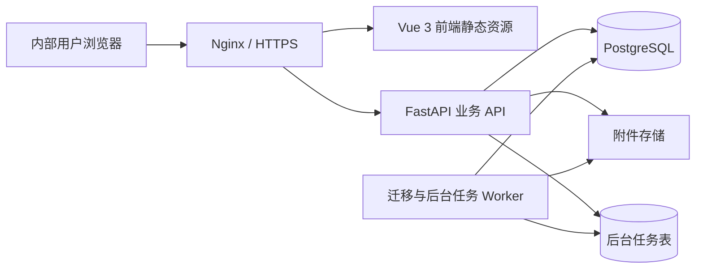

# 招聘信息管理系统 V1 技术设计

| 项目 | 内容 |
|---|---|
| 技术设计版本 | V1.0 |
| 对应产品文档 | 招聘信息管理系统 V1.1 产品需求文档 |
| 文档状态 | 技术基线已确认 |
| 更新日期 | 2026-08-27 |

## 1. 设计目标

本技术设计用于将已确认的招聘业务基线转换为可开发、可测试、可迁移和可部署的系统方案。

核心目标：

1. 保证候选人状态流转严格、可审计，不允许随意跨阶段。
2. 保持系统轻量，适合招聘部门内部使用和单服务器部署。
3. 支持一个需求分配多名 HR，但一名候选人由一名招聘负责人负责到底。
4. 支持推荐阶段数字统计、合格后候选人建档的轻量模式。
5. 支持按发生时间和按推荐批次两种看板口径。
6. 支持 2026 年 1 月以来 Excel 历史数据迁移和原始备注全文保存。
7. 为再次应聘、劳务外包、外部通知和平台接口预留扩展能力，但不增加 V1 操作负担。

## 2. 设计假设

在部署环境尚未最终确认前，本方案采用以下合理假设：

- 系统主要运行在公司内网或受控网络。
- 以桌面浏览器使用为主。
- 初期用户约 10～100 人，并发操作量较低。
- 候选人及事件数据量预计为万级到十万级，单体应用足以承载。
- V1 不与招聘平台、企业微信、邮件或外部 Offer 审批系统集成。
- V1 采用一个业务组织，保留组织架构层级。
- 生产数据库使用 PostgreSQL，不使用 Excel 作为运行期数据库。

如果实际部署环境不支持 Docker、PostgreSQL 或 Linux，需要在开发启动前调整部署方案，但不影响下述业务数据模型。

## 3. 推荐技术栈

### 3.1 前端

| 项目 | 推荐方案 |
|---|---|
| 框架 | Vue 3 |
| 语言 | TypeScript |
| 构建工具 | Vite |
| 路由 | Vue Router |
| 状态管理 | Pinia |
| 组件库 | Element Plus |
| 图表 | Apache ECharts |
| 请求与缓存 | Axios + 轻量查询封装 |
| 单元测试 | Vitest |
| 端到端测试 | Playwright |

选择理由：适合内部管理系统，表格、表单、弹窗、筛选和看板组件成熟，开发成本较低。

### 3.2 后端

| 项目 | 推荐方案 |
|---|---|
| Web 框架 | FastAPI |
| 语言 | Python 3.12+ |
| 数据校验 | Pydantic v2 |
| ORM | SQLAlchemy 2 |
| 数据库迁移 | Alembic |
| Excel 迁移 | openpyxl + 自定义迁移服务 |
| 后台任务 | PostgreSQL 任务表 + 独立 Worker 进程 |
| 测试 | pytest |

V1 不强制引入 Redis、Kafka、微服务或复杂工作流引擎。候选人状态机在后端领域服务中实现，后台导入任务由同一代码库中的 Worker 处理。

### 3.3 数据与部署

| 项目 | 推荐方案 |
|---|---|
| 数据库 | PostgreSQL 16+ |
| 反向代理 | Nginx |
| 容器 | Docker Compose |
| 附件存储 | 服务器持久化目录；预留 S3/MinIO 接口 |
| 日志 | 结构化 JSON 日志 + 文件轮转 |
| 备份 | PostgreSQL 定时备份 + 附件目录备份 |

## 4. 总体架构



采用模块化单体结构：

- 单一前端应用
- 单一后端代码库
- 一个 API 进程组
- 一个后台 Worker
- 一个 PostgreSQL 数据库

模块之间在代码层隔离，不在 V1 拆分成独立微服务。

## 5. 后端模块划分

```text
app/
├─ auth/                 登录、会话、密码与权限
├─ users/                用户、角色、组织架构
├─ dictionaries/         渠道、Out原因、岗位类型等字典
├─ demands/              招聘需求及参与HR
├─ workloads/            简历推荐数字工作量
├─ candidates/           候选人基础信息及编号
├─ applications/         应聘记录、负责人、状态机
├─ interviews/           初试与复试
├─ offers/               Offer沟通、外部审批状态及发送结果
├─ onboarding/           待报到、延期与入职
├─ todos/                站内待办
├─ dashboards/           漏斗、工作量、效率及Out分析
├─ attachments/          简历与Offer附件
├─ migrations/           Excel导入、映射、核验与对账
├─ audit/                操作审计日志
└─ shared/               数据库、异常、分页、通用类型
```

## 6. 身份认证与会话

### 6.1 V1 登录方式

V1 推荐使用系统本地账号：

- 用户名或工号
- 密码
- 账号状态
- 所属组织
- 角色

后续可增加企业统一身份认证，不改变业务表结构。

### 6.2 会话安全

- 使用服务端会话或短期访问令牌配合 HttpOnly、Secure Cookie。
- 不在浏览器 LocalStorage 保存长期认证令牌。
- 密码使用 Argon2id 或同等级算法哈希。
- 登录、退出、密码重置、连续失败均记录安全日志。
- 写操作增加 CSRF 防护或使用严格 SameSite Cookie 策略。

## 7. 权限模型

权限由“角色权限 + 数据范围”共同决定。

### 7.1 角色

- `HR`：普通 HR
- `RECRUITMENT_MANAGER`：招聘管理者
- `SYSTEM_ADMIN`：系统管理员

### 7.2 数据范围

普通 HR：

- 可以查看本人参与的招聘需求。
- 可以查看本人创建的推荐工作量记录。
- 可以查看和推进 `application.owner_user_id = 当前用户` 的候选人。

招聘管理者：

- 可以查看全部招聘需求、工作量和候选人。
- 可以转交候选人、修正业务数据和查看部门看板。

系统管理员：

- 可以维护用户、字典、编号规则、迁移任务和审计数据。
- 系统管理员的数据修复操作不得绕过审计日志。

### 7.3 权限实现要求

- 权限必须由后端校验，不能只依赖前端隐藏按钮。
- 列表查询必须自动应用数据范围过滤。
- 导出接口使用与列表查询相同的数据权限。
- 附件下载必须经过业务权限校验，不暴露真实服务器路径。

## 8. 数据库通用约定

- 内部主键使用 UUID。
- 业务编号使用独立唯一字段，例如候选人编号、需求编号。
- 时间统一以 UTC 保存，前端按 `Asia/Shanghai` 展示。
- 所有业务表包含 `created_at`、`created_by`、`updated_at`、`updated_by`。
- 关键表包含整数 `version` 字段，用于乐观锁并发控制。
- 业务状态使用字符串代码，不依赖 PostgreSQL Enum，便于后续迁移和扩展。
- 业务删除优先采用 `voided_at`、`voided_by`、`void_reason`，不物理删除。
- 长备注使用 `text` 类型，不限制为短字符串。
- 金额使用 `numeric`，不得使用浮点数。

## 9. 核心数据库模型

### 9.1 `users` 用户

| 字段 | 类型 | 说明 |
|---|---|---|
| id | uuid | 主键 |
| username | varchar | 登录名，唯一 |
| display_name | varchar | 姓名 |
| employee_no | varchar | 工号，可选 |
| org_unit_id | uuid | 所属组织 |
| status | varchar | active、disabled |
| password_hash | varchar | 密码哈希 |
| last_login_at | timestamptz | 最近登录时间 |

角色通过 `user_roles` 关联。

### 9.2 `org_units` 组织架构

| 字段 | 类型 | 说明 |
|---|---|---|
| id | uuid | 主键 |
| parent_id | uuid | 上级组织，可空 |
| unit_type | varchar | company、department |
| name | varchar | 组织名称 |
| code | varchar | 组织编码 |
| status | varchar | active、disabled |

### 9.3 `recruitment_demands` 招聘需求

| 字段 | 类型 | 说明 |
|---|---|---|
| id | uuid | 主键 |
| demand_code | varchar | 需求编号，唯一 |
| title | varchar | 需求名称 |
| company_id | uuid | 所属公司 |
| department_id | uuid | 所属部门 |
| position_name | varchar | 招聘岗位 |
| headcount | integer | 招聘人数 |
| position_type_code | varchar | 岗位类型 |
| difficulty_code | varchar | 难度等级 |
| work_locations | jsonb | 工作地点列表 |
| project_name | varchar | 项目，可空 |
| manager_user_id | uuid | 需求负责人，可空 |
| priority_code | varchar | high、medium、low |
| status | varchar | draft、recruiting、paused、completed、closed |
| target_offer_date | date | 目标 Offer 日期 |
| target_onboard_date | date | 目标到岗日期 |
| paused_at | timestamptz | 暂停时间 |
| pause_reason | text | 暂停原因 |
| description | text | 补充说明 |
| version | integer | 乐观锁版本 |

### 9.4 `demand_assignments` 需求参与 HR

| 字段 | 类型 | 说明 |
|---|---|---|
| id | uuid | 主键 |
| demand_id | uuid | 招聘需求 |
| user_id | uuid | 参与 HR |
| assigned_at | timestamptz | 分配时间 |
| assigned_by | uuid | 分配人 |
| removed_at | timestamptz | 取消参与时间，可空 |

唯一约束：同一需求与 HR 的有效分配记录不得重复。

### 9.5 `resume_workloads` 简历推荐工作量

| 字段 | 类型 | 说明 |
|---|---|---|
| id | uuid | 主键 |
| recommendation_date | date | 推荐日期 |
| demand_id | uuid | 招聘需求 |
| owner_user_id | uuid | 推荐 HR |
| channel_code | varchar | 招聘渠道 |
| recommended_count | integer | 推荐简历数 |
| note | text | 备注 |
| data_quality_status | varchar | confirmed、needs_review |
| version | integer | 乐观锁版本 |

有效记录唯一约束：

```text
recommendation_date + demand_id + owner_user_id + channel_code
```

合格数不冗余存储，默认从应聘记录实时或聚合计算；若后续性能需要，可建立物化汇总，不改变事实来源。

### 9.6 `candidate_number_sequences` 候选人年度编号序列

| 字段 | 类型 | 说明 |
|---|---|---|
| year | integer | 主键年份 |
| last_value | bigint | 最近已分配序号 |
| prefix | varchar | 默认 GL |
| width | integer | 默认 6 |

编号分配必须在数据库事务中锁定年度序列行，生成：

```text
GL2026-000001
```

编号一经分配不得回收。

### 9.7 `candidates` 候选人

| 字段 | 类型 | 说明 |
|---|---|---|
| id | uuid | 主键 |
| candidate_code | varchar | 候选人编号，唯一、不可修改 |
| name | varchar | 姓名 |
| mobile | varchar | 手机号，可空，不作为强制唯一键 |
| email | varchar | 邮箱，可空 |
| wechat | varchar | 微信，可空 |
| current_company | varchar | 当前公司 |
| current_position | varchar | 当前岗位 |
| current_city | varchar | 当前城市 |
| duplicate_hint | jsonb | 非阻断式疑似重复提示结果 |

### 9.8 `applications` 候选人应聘记录

V1 中一名候选人只建立一条应聘记录，但数据模型保留候选人与应聘记录一对多关系，便于后续再次应聘扩展。

| 字段 | 类型 | 说明 |
|---|---|---|
| id | uuid | 主键 |
| candidate_id | uuid | 候选人 |
| demand_id | uuid | 招聘需求 |
| owner_user_id | uuid | 招聘负责人 |
| recommendation_date | date | 推荐日期 |
| channel_code | varchar | 招聘渠道 |
| current_status | varchar | 当前业务状态 |
| status_entered_at | timestamptz | 进入当前状态时间 |
| is_frozen | boolean | 是否因需求暂停冻结 |
| frozen_at | timestamptz | 冻结时间 |
| pre_freeze_status | varchar | 冻结前状态 |
| total_frozen_seconds | bigint | 累计冻结时长 |
| resume_note | text | 简历备注 |
| historical_original_note | text | 历史源表备注全文 |
| historical_source | jsonb | 来源文件、工作表、行号 |
| data_quality_status | varchar | confirmed、inferred、needs_review |
| version | integer | 乐观锁版本 |

约束：

- V1 阶段同一候选人只能存在一条未作废应聘记录。
- `owner_user_id` 必须是该需求的有效参与 HR。
- 普通流转必须满足 `is_frozen = false`。

### 9.9 `contact_logs` 联系记录

| 字段 | 类型 | 说明 |
|---|---|---|
| id | uuid | 主键 |
| application_id | uuid | 应聘记录 |
| contact_type | varchar | phone、wechat、email、other |
| contacted_at | timestamptz | 联系时间 |
| result_code | varchar | reached、no_answer、pending 等 |
| note | text | 联系内容 |
| next_followup_at | timestamptz | 下次跟进时间 |

### 9.10 `interviews` 面试记录

| 字段 | 类型 | 说明 |
|---|---|---|
| id | uuid | 主键 |
| application_id | uuid | 应聘记录 |
| round_code | varchar | initial、review |
| appointment_status | varchar | pending、scheduled、completed、cancelled、no_show |
| scheduled_at | timestamptz | 预约时间 |
| actual_started_at | timestamptz | 实际面试时间 |
| interview_mode | varchar | onsite、online、phone |
| location_or_link | text | 地点或会议链接 |
| interviewer_names | jsonb | 面试官姓名列表，不创建面试官账号 |
| result_code | varchar | passed、pending、failed |
| evaluation | text | 面试评价 |
| pending_reason | text | 待定原因 |
| next_review_at | timestamptz | 待定确认时间 |
| failure_reason_code | varchar | 不通过原因 |
| version | integer | 乐观锁版本 |

### 9.11 `offers` Offer 记录

| 字段 | 类型 | 说明 |
|---|---|---|
| id | uuid | 主键 |
| application_id | uuid | 应聘记录，唯一 |
| negotiation_status | varchar | negotiating、agreed、failed |
| current_salary | numeric | 当前薪资，可空 |
| expected_salary | numeric | 期望薪资，可空 |
| proposed_salary | numeric | 拟定薪资，可空 |
| salary_note | text | 薪资结构说明 |
| approval_status | varchar | pending、approved、rejected |
| approval_updated_at | timestamptz | 外部审批状态更新时间 |
| approval_note | text | 可选备注 |
| sent_at | timestamptz | Offer 发送时间 |
| response_deadline | timestamptz | 回复截止时间 |
| response_status | varchar | pending、accepted、rejected、expired |
| responded_at | timestamptz | 回复时间 |
| expected_onboard_date | date | 预计报到日期 |
| version | integer | 乐观锁版本 |

### 9.12 `onboardings` 报到与入职

| 字段 | 类型 | 说明 |
|---|---|---|
| id | uuid | 主键 |
| application_id | uuid | 应聘记录，唯一 |
| expected_date | date | 当前预计报到日期 |
| actual_date | date | 实际入职日期 |
| status | varchar | pending、postponed、onboarded、abandoned |
| postponement_count | integer | 延期次数 |
| latest_postpone_reason | text | 最近延期原因 |
| version | integer | 乐观锁版本 |

每次延期的原日期、新日期和原因同时写入流转事件，不只保留最新值。

### 9.13 `terminations` 流程终止

| 字段 | 类型 | 说明 |
|---|---|---|
| id | uuid | 主键 |
| application_id | uuid | 应聘记录，唯一有效终止记录 |
| stage_code | varchar | 终止前阶段 |
| initiator_type | varchar | candidate、company、objective |
| primary_reason_code | varchar | 一级原因 |
| secondary_reason_code | varchar | 二级原因 |
| detail | text | 详细备注 |
| terminated_at | timestamptz | 终止时间 |
| terminated_by | uuid | 操作人 |

### 9.14 `flow_events` 业务流转事件

追加写入，不允许修改和删除。

| 字段 | 类型 | 说明 |
|---|---|---|
| id | uuid | 主键 |
| application_id | uuid | 应聘记录 |
| event_type | varchar | created、transitioned、frozen、resumed、transferred 等 |
| from_status | varchar | 原状态，可空 |
| to_status | varchar | 新状态，可空 |
| event_at | timestamptz | 业务事件时间 |
| operator_user_id | uuid | 操作账号 |
| payload | jsonb | 事件补充信息 |
| source | varchar | ui、migration、system |

### 9.15 `todos` 站内待办

| 字段 | 类型 | 说明 |
|---|---|---|
| id | uuid | 主键 |
| assigned_user_id | uuid | 待办责任人 |
| application_id | uuid | 应聘记录，可空 |
| demand_id | uuid | 招聘需求，可空 |
| todo_type | varchar | 待办类型 |
| title | varchar | 待办标题 |
| due_at | timestamptz | 截止时间 |
| status | varchar | open、completed、cancelled、suspended |
| dedup_key | varchar | 防止重复生成 |
| completed_at | timestamptz | 完成时间 |

### 9.16 字典表

使用 `dictionary_types` 和 `dictionary_items` 管理：

- 招聘渠道
- 岗位类型
- 难度等级
- 优先级
- Out 一级/二级原因
- 联系结果
- 面试失败原因

字典项停用后不得用于新记录，但历史记录仍可正常展示。

### 9.17 附件

`attachments` 保存元数据，文件本体保存在持久化目录或对象存储：

- 简历
- Offer 文件
- 其他候选人附件

下载使用受控接口，不提供可猜测的公开 URL。

### 9.18 审计日志

`audit_logs` 记录：

- 登录账号
- 操作类型
- 业务对象类型及 ID
- 修改前后字段
- 请求追踪 ID
- IP 和客户端信息
- 操作时间

业务流转使用 `flow_events`，系统级字段修改和管理操作使用 `audit_logs`，两者职责不同。

## 10. 应聘状态代码

| 代码 | 中文状态 |
|---|---|
| INITIAL_INVITE_PENDING | 待约初试 |
| INITIAL_CONFIRMING | 初试待确认 |
| INITIAL_SCHEDULED | 初试已预约 |
| INITIAL_FEEDBACK_PENDING | 初试待反馈 |
| INITIAL_ON_HOLD | 初试待定 |
| REVIEW_INVITE_PENDING | 待约复试 |
| REVIEW_CONFIRMING | 复试待确认 |
| REVIEW_SCHEDULED | 复试已预约 |
| REVIEW_FEEDBACK_PENDING | 复试待反馈 |
| REVIEW_ON_HOLD | 复试待定 |
| OFFER_NEGOTIATING | Offer 沟通中 |
| OFFER_APPROVING | Offer 审批中 |
| OFFER_SENT_PENDING | Offer 已发待确认 |
| OFFER_ACCEPTED_PENDING_ONBOARD | 已接 Offer 待报到 |
| ONBOARD_POSTPONED | 延期报到 |
| ONBOARDED | 已入职 |
| TERMINATED | 已终止 |

需求暂停冻结不作为新的 `current_status`，使用 `is_frozen` 与 `pre_freeze_status` 叠加表达，避免丢失原阶段。

## 11. 状态机实现

### 11.1 领域服务

所有候选人推进通过统一 `ApplicationWorkflowService` 执行，禁止普通 CRUD 接口直接修改 `current_status`。

每次业务动作在同一数据库事务中完成：

1. 锁定并读取应聘记录。
2. 校验操作者权限。
3. 校验需求是否招聘中、应聘记录是否冻结。
4. 校验当前状态是否允许该动作。
5. 校验动作必填字段。
6. 写入面试、Offer、报到或终止数据。
7. 更新应聘记录当前状态和版本。
8. 追加写入 `flow_events`。
9. 完成旧待办并生成新待办。

任一步骤失败时整笔事务回滚。

### 11.2 并发控制

前端提交状态动作时携带当前 `version`。如果后台发现版本已变化，返回 `409 Conflict`，提示用户刷新后重试，防止管理者和 HR 同时更新造成状态覆盖。

### 11.3 需求暂停

暂停需求必须在一个受控业务命令中完成：

1. 将需求状态改为 `paused`。
2. 查询所有非终态应聘记录。
3. 保存 `pre_freeze_status`，设置 `is_frozen = true` 和 `frozen_at`。
4. 追加 `frozen` 流转事件。
5. 将相关开放待办改为 `suspended`。
6. 对未来面试、Offer 截止日和报到安排保留原记录但标记需要恢复后确认。

恢复需求时：

1. 将需求状态改为 `recruiting`。
2. 计算冻结时长并累计到 `total_frozen_seconds`。
3. 解除冻结。
4. 未过期安排恢复原待办。
5. 已过期安排生成重新确认待办，并将候选人调整到对应待确认状态。
6. 追加 `resumed` 流转事件。

### 11.4 转交候选人

仅招聘管理者和系统管理员可执行。转交动作记录原负责人、新负责人、原因和时间；不修改候选人编号及历史推荐工作量。

## 12. API 设计原则

- 路径前缀：`/api/v1`
- 使用 JSON 传输业务数据。
- 列表接口统一分页、排序和筛选格式。
- 时间使用 ISO 8601。
- 错误返回统一包含 `code`、`message`、`details`、`request_id`。
- 状态变化使用业务动作接口，不开放任意状态字段更新。
- 导入和大型导出使用异步任务。

## 13. 主要 API

### 13.1 登录与用户

```text
POST   /api/v1/auth/login
POST   /api/v1/auth/logout
GET    /api/v1/auth/me
GET    /api/v1/users
POST   /api/v1/users
PATCH  /api/v1/users/{id}
```

### 13.2 招聘需求

```text
GET    /api/v1/demands
POST   /api/v1/demands
GET    /api/v1/demands/{id}
PATCH  /api/v1/demands/{id}
POST   /api/v1/demands/{id}/assignments
DELETE /api/v1/demands/{id}/assignments/{userId}
POST   /api/v1/demands/{id}/pause
POST   /api/v1/demands/{id}/resume
POST   /api/v1/demands/{id}/complete
POST   /api/v1/demands/{id}/close
```

### 13.3 简历推荐工作量

```text
GET    /api/v1/resume-workloads
POST   /api/v1/resume-workloads
PATCH  /api/v1/resume-workloads/{id}
POST   /api/v1/resume-workloads/{id}/void
```

### 13.4 候选人与应聘记录

```text
GET    /api/v1/candidates
POST   /api/v1/candidates
GET    /api/v1/candidates/{candidateId}
GET    /api/v1/applications
GET    /api/v1/applications/{applicationId}
POST   /api/v1/applications/{applicationId}/contacts
POST   /api/v1/applications/{applicationId}/transfer
```

创建候选人接口在同一事务内创建候选人、应聘记录、候选人编号和建档流转事件。

### 13.5 状态动作接口

推荐使用命令式动作接口：

```text
POST /api/v1/applications/{id}/actions/start-initial-invite
POST /api/v1/applications/{id}/actions/schedule-initial
POST /api/v1/applications/{id}/actions/mark-initial-attended
POST /api/v1/applications/{id}/actions/record-initial-result
POST /api/v1/applications/{id}/actions/start-review-invite
POST /api/v1/applications/{id}/actions/schedule-review
POST /api/v1/applications/{id}/actions/mark-review-attended
POST /api/v1/applications/{id}/actions/record-review-result
POST /api/v1/applications/{id}/actions/update-offer-negotiation
POST /api/v1/applications/{id}/actions/update-offer-approval
POST /api/v1/applications/{id}/actions/send-offer
POST /api/v1/applications/{id}/actions/record-offer-response
POST /api/v1/applications/{id}/actions/postpone-onboarding
POST /api/v1/applications/{id}/actions/confirm-onboarding
POST /api/v1/applications/{id}/actions/terminate
```

每个动作接口只接受该动作必要字段并校验当前状态。

### 13.6 工作台与待办

```text
GET  /api/v1/workbench/summary
GET  /api/v1/todos
POST /api/v1/todos/{id}/complete
```

业务待办通常由状态动作自动完成，不建议用户手工关闭与业务事实冲突的待办。

### 13.7 看板

```text
GET /api/v1/dashboards/workload
GET /api/v1/dashboards/funnel
GET /api/v1/dashboards/hr-comparison
GET /api/v1/dashboards/out-reasons
GET /api/v1/dashboards/efficiency
GET /api/v1/dashboards/demand-progress
```

通用参数：

```text
date_from
date_to
time_mode=activity|cohort
hr_ids[]
company_ids[]
department_ids[]
demand_ids[]
channel_codes[]
difficulty_codes[]
```

## 14. 看板计算实现

### 14.1 事实来源

| 指标 | 事实表与时间字段 |
|---|---|
| 推荐简历数 | resume_workloads.recommendation_date |
| 简历合格数 | applications.recommendation_date |
| 初试完成数 | interviews.actual_started_at，round=initial |
| 初试通过数 | interviews.result_code=passed |
| 复试完成数 | interviews.actual_started_at，round=review |
| 复试通过数 | interviews.result_code=passed |
| Offer 发放数 | offers.sent_at |
| Offer 接受数 | offers.responded_at，response_status=accepted |
| 入职数 | onboardings.actual_date |

### 14.2 按发生时间

每个指标使用自己的业务发生日期落入筛选时间范围。适合当期工作量，但不同漏斗层可能不是同一批候选人。

### 14.3 按推荐批次

先筛选 `applications.recommendation_date` 落入时间范围的应聘记录，再统计这批记录后续到达各阶段的情况。

推荐简历总数仍来自相同时间范围的 `resume_workloads`。由于未合格简历没有候选人记录，推荐层到合格层的转换以工作量汇总与候选人建档数量结合计算。

### 14.4 暂停时长

- 普通自然招聘周期可以显示总自然天数。
- 有效处理时长应扣除需求暂停冻结时间。
- 看板需明确区分自然周期和有效周期，默认管理效率指标使用有效周期。

### 14.5 查询性能

V1 优先使用 PostgreSQL 聚合查询和必要索引。数据量增长后再增加：

- 日级指标汇总表
- 物化视图
- 定时刷新任务

不得为了看板性能改变原始事实表口径。

## 15. 索引建议

```text
recruitment_demands(status, target_onboard_date)
demand_assignments(user_id, removed_at)
resume_workloads(owner_user_id, recommendation_date)
resume_workloads(demand_id, recommendation_date)
candidates(candidate_code unique)
candidates(name)
candidates(mobile)
applications(owner_user_id, current_status)
applications(demand_id, current_status)
applications(recommendation_date, owner_user_id)
applications(is_frozen, current_status)
interviews(application_id, round_code)
interviews(actual_started_at, round_code, result_code)
offers(sent_at, response_status)
onboardings(actual_date, status)
flow_events(application_id, event_at)
todos(assigned_user_id, status, due_at)
audit_logs(object_type, object_id, created_at)
```

## 16. 站内待办生成

待办使用业务事件驱动生成：

| 事件 | 生成待办 |
|---|---|
| 面试时间临近 | 今日待面试 |
| 面试已完成但无结果 | 面试结果待反馈 |
| 面试结果待定 | 到期确认待办 |
| Offer 已发送 | Offer 回复跟进 |
| Offer 接近回复截止日 | Offer 截止提醒 |
| Offer 已接受 | 近期待报到 |
| 预计报到日期变更 | 延期跟进 |
| 状态长时间无更新 | 超期未更新 |
| 需求临近目标日期 | 需求交付预警 |

短周期待办可在业务动作中直接生成；基于日期的提醒由 Worker 定时扫描生成。`dedup_key` 防止同一业务条件重复生成多条待办。

## 17. 历史数据迁移架构

### 17.1 迁移分层


### 17.2 迁移表

#### `migration_batches`

- 批次编号
- 文件名称及哈希
- 导入时间
- 状态
- 总行数
- 成功、待核验、失败数量
- 操作人

#### `migration_source_rows`

- 批次 ID
- 来源工作表
- 原始行号
- 原始数据 JSON
- 原始备注全文
- 标准化数据 JSON
- 映射状态
- 目标业务对象 ID
- 错误或核验说明

### 17.3 迁移流程

1. 对原始文件计算哈希，防止同一文件重复导入。
2. 将每一行完整写入原始暂存层，不直接写业务表。
3. 统一日期、公司、部门、岗位、渠道、HR 和状态。
4. 按姓名、需求/岗位、HR 和时间连续性尝试关联候选人阶段。
5. 对无法可靠关联的记录生成“待人工核验”。
6. 根据最早业务日期按年份生成候选人编号。
7. 将原始备注全文写入 `historical_original_note`，并保留来源定位。
8. 写入业务表和 `flow_events`，事件来源标记为 `migration`。
9. 按月核对推荐、面试、Offer、接受 Offer 和入职总量。

劳务外包行只保留在迁移暂存层，不进入 V1 候选人和应聘业务表。

### 17.4 迁移幂等性

- 同一文件哈希和工作表行号不得重复导入。
- 重跑批次前先清理该批次未提交的暂存结果。
- 已提交业务记录不允许通过简单重跑覆盖，必须使用迁移修正流程。

## 18. 附件与备注

- 简历和 Offer 附件使用 UUID 文件名保存，数据库保留原始文件名和 MIME 类型。
- 单文件大小和允许类型由系统参数配置。
- 文本备注使用 `text`，完整保存历史源文，不做业务层截断。
- 列表只返回摘要，详情接口返回全文，避免大字段拖慢列表。
- 导出时对换行和长文本进行正确转义。

## 19. 审计与可追溯性

必须能够回答：

- 谁在什么时候创建了候选人？
- 候选人何时从哪个阶段进入哪个阶段？
- 谁录入了初试或复试结果？
- Offer 外部审批状态何时变化？
- 谁将候选人终止，终止原因是什么？
- 谁暂停或恢复了需求？
- 谁转交了候选人？
- 哪条历史数据来自哪个文件、工作表和行号？

流转事件和审计日志应避免保存登录密码、完整认证令牌等秘密数据。

## 20. 错误处理

推荐业务错误码：

| 错误码 | 场景 |
|---|---|
| DEMAND_NOT_RECRUITING | 需求不是招聘中 |
| USER_NOT_ASSIGNED | HR 未参与该需求 |
| APPLICATION_FROZEN | 候选人因需求暂停被冻结 |
| INVALID_TRANSITION | 当前状态不允许该动作 |
| VERSION_CONFLICT | 数据已被其他人更新 |
| WORKLOAD_UNDERFLOW | 合格人数超过推荐数 |
| DUPLICATE_HINT | 存在疑似重复候选人，非阻断提示 |
| REQUIRED_REASON_MISSING | 待定或终止原因缺失 |
| DATE_SEQUENCE_INVALID | 业务日期顺序错误 |

## 21. 测试策略

### 21.1 单元测试

- 候选人编号年度序列
- 状态机允许与禁止的转换
- 需求暂停和恢复
- 待办生成及去重
- 漏斗和转化率计算
- 数据权限过滤
- 历史字段映射

### 21.2 集成测试

- 创建需求并分配多名 HR
- HR 录入推荐数并创建合格候选人
- 完整初试、复试、Offer、入职链路
- 每个阶段的 Out 分支
- 外部 Offer 审批三状态
- 管理者转交候选人
- 并发版本冲突
- Excel 导入和对账

### 21.3 端到端测试

使用 Playwright 覆盖：

- 普通 HR 日常闭环
- 招聘管理者查看和筛选全量数据
- 多 HR 漏斗对比
- 暂停需求后无法推进候选人
- 恢复需求后重新生成待办
- 历史迁移核验页面

## 22. 部署建议

推荐 Docker Compose 服务：

```text
nginx
frontend
api
worker
postgres
```

生产环境要求：

- 使用 HTTPS。
- PostgreSQL 和附件目录使用持久化卷。
- 每日数据库备份并定期验证恢复。
- 备份文件不得与唯一生产磁盘放在同一故障域。
- 环境变量和秘密使用部署配置管理，不写入代码仓库。
- 开发、测试、生产环境数据库分离。

## 23. 技术风险与控制

| 风险 | 控制方式 |
|---|---|
| 早期推荐只有数字，无法逐份追踪 | 明确方案 B 口径，合格后才进入候选人级漏斗 |
| 历史 Excel 结构不一致 | 原始暂存、字典映射、待核验和分月对账 |
| 同名候选人误合并 | 不强制自动合并，疑似记录进入人工核验 |
| 状态被跨阶段修改 | 所有推进通过状态机动作接口 |
| 多人同时更新覆盖 | 乐观锁与 409 冲突处理 |
| 需求暂停后仍被推进 | 应聘冻结标记 + 后端强制校验 |
| 长备注影响列表性能 | 列表摘要、详情全文、字段按需加载 |
| 看板口径争议 | 固化事实表、时间字段和两种时间模式 |
| 敏感数据泄露 | 数据范围权限、受控附件、审计和 HTTPS |

## 24. 已确认的部署输入

1. 最终部署系统为 Linux。
2. 允许使用 Docker、Docker Compose 和 PostgreSQL。
3. 用户通过内部域名访问。
4. 已有 Git 远程仓库；当前工作区尚未连接，需要提供远程地址或正确代码目录。
5. 初始用户由系统管理员手工创建。
6. 简历与 Offer 附件存储在服务器本地持久化目录，并纳入备份。
7. 内部域名的具体名称、HTTPS 证书接入方式和附件容量在生产部署前配置，不阻塞开发。
